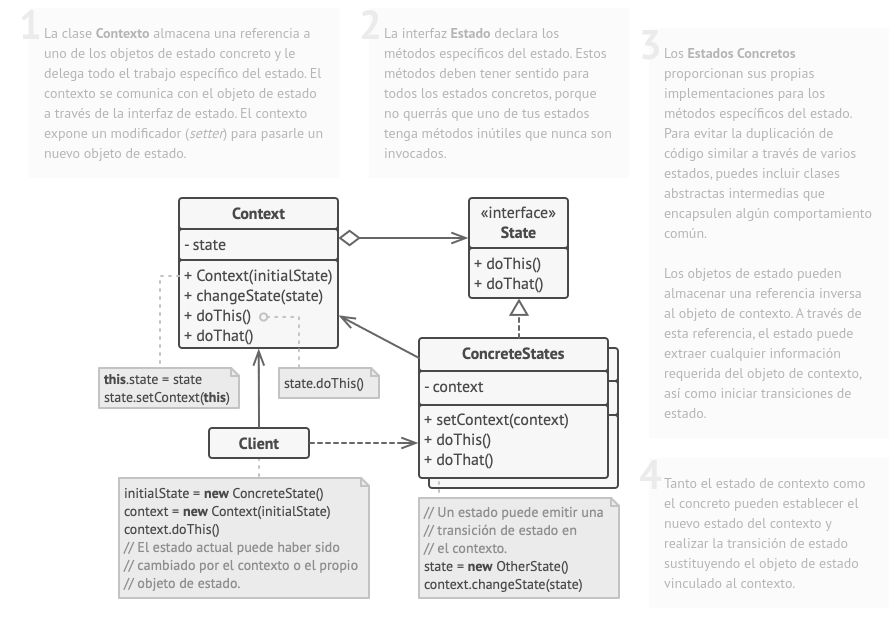

# TP 02.
## Patron State / Libreria

State es un patrón de diseño de comportamiento que permite a un objeto alterar su comportamiento cuando su estado interno cambia. Parece como si el objeto cambiara su clase.

La idea principal es que, en cualquier momento dado, un programa puede encontrarse en un número finito de estados. Dentro de cada estado único, el programa se comporta de forma diferente y puede cambiar de un estado a otro instantáneamente. Sin embargo, dependiendo de un estado actual, el programa puede cambiar o no a otros estados. Estas normas de cambio llamadas transiciones también son finitas y predeterminadas.

### Problema - Dominio

Necesitamos identificar y controlar los estados de los libros que estan dentro de nuestra biblioteca. Un libro puede estar en los siguientes estado:
- ingresado: es el estado inicial
- revision: se revisa si tiene que ser reparado o puede pasar a estar diponible
- diponible: el libro esta disponible para venderlo o para alquilarlo
- reparacion: el libro necesita ser reparado y puede ser dado de baja o puede estar disponible
- baja: el libro no puede ser reparado y es dado de baja
- alquilado: el libro puede ser prestado por un tiempo x 
- vendido: un libro puede ser vendido 

el siguiente diagrama indica como se pasa de un estado a otro:


### Solucion
en el codigo podra encontrar la implementacion del patron state sobre este caso. La clase App es la que ejecuta los cambios de estado sobre un objeto `Libro` y de forma aleatoria cambia la accion la cual define a que estado pasa en la siguiente iteracion.

los cambios de estado estan definidos en cada uno de los estados:

```java
public class Reparacion implements IEstado {
    private Libro libro ;

    public Reparacion(Libro libro){
        this.libro = libro;
    }

    public void hacer(){
        
        if(this.libro.getAccion() == 1){
            //mal estado
            System.out.println(this.libro.getNombre()+" Libro irreparable...");
            this.libro.setEstado(new Baja(this.libro));
        }else{
            //buen estado
            System.out.println(this.libro.getNombre()+" Libro reparado ... pasa a estar disponible...");
            this.libro.setEstado(new Disponible(libro));
        }
    }
}

public class Revision implements IEstado   {
    private Libro libro;

    public Revision(Libro libro){
        this.libro = libro;
    }
    
    public void hacer(){
        if(this.libro.getAccion() == 1){
            //pasa a reparacion
            System.out.println(this.libro.getNombre()+" libro revisado y enviado a reparar...");
            this.libro.setEstado(new Reparacion(this.libro));
        }else{
            //el libro pasa a diponible
            System.out.println(this.libro.getNombre()+" libro revisado y puesto en disponibilidad...");
            this.libro.setEstado(new Disponible(this.libro));
        }
    }
}
```

de esta manera desde libro solo hacemos:
```java
public class Libro implements IEstado{
    
    ...

    public void hacer(){

        this.estado.hacer();
    }

    public void setEstado(IEstado estado){
        this.estado = estado;
    }

    public int getAccion(){
        return accion;
    }

    public void setAccion(int accion){
        this.accion = accion;
    }
}
```

la interfaz define que metodos son los que se ejecutan diferente dependiendo del estado. es necesario que estos metodos sean delegados del libro a cada uno de los estados.




## Desventajas
Puede resultar excesivo si se cuenta con pocos estados.

## ExecutorService
Es una interfaz en java que propociona un marco para la gestion de tareas asincronas. ofrece una manera mas robusta y flexible de manejar la concurrencia que simplemente usando hilos.

- gestino de hilos: a diferencia de crear y gestionar hilos manualemnte, permite delegar la responsabilidad lo que facilita la reutilizacion de hilos y la optimizacion de rendimiento.
- terminacion controlada: permite cerrar el servicio de manera controlada.
- programacion de tareas: puede programar tareas para que se ejecuten despues de un retardo o periodicamente con `SheduledExecutorService`.
- recuperacion de resultados: puedes usar `submit()` en lugar de `execute()` para obtener el `Feature`, que representa el resultado pendiente de una tarea.

## Runnable 

(lo venimos usando en concurrente 🤕).
Es una interfaz funcional de java que debe implementarse para definir una tarea que puede ser ejecutada por un hilo o un servicio en ejecucion.

## Solucion
este mecanismo soluciona la gestion de hilos, y la programacion de tareas.


## Getting Started vscode

Welcome to the VS Code Java world. Here is a guideline to help you get started to write Java code in Visual Studio Code.

## Folder Structure

The workspace contains two folders by default, where:

- `src`: the folder to maintain sources
- `lib`: the folder to maintain dependencies

Meanwhile, the compiled output files will be generated in the `bin` folder by default.

> If you want to customize the folder structure, open `.vscode/settings.json` and update the related settings there.

## Dependency Management

The `JAVA PROJECTS` view allows you to manage your dependencies. More details can be found [here](https://github.com/microsoft/vscode-java-dependency#manage-dependencies).
